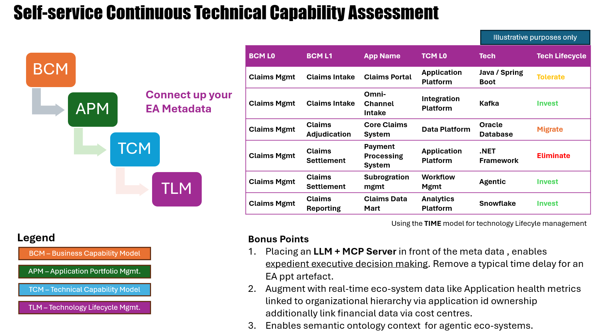

## Description ##
In many large organizations we see Enterprise Architecture inventory datasets belonging to Business Architecture, Data Architecture, Application and Technology Architecture are locked away in proprietary tooling maintained by Enterprise Architecture teams who require an intake system and then turnaround time depending on the skill and familiarity of the Enterprise Architect to pull together a deck showing the as-is state of a capability or portfolio of capabilities often in a hurry around annual planning time.  While it preserves the tacit knowledge of the Enterprise Architect/Enterprise Architecture group it often leads to negative NPS (Net Promotor Score) of the Enterprise Architecture group being ivory tower or being slow to turnaround deliverables.  

## Overview ##
Think Enterprise Architecture as-a Service (EAaaS) Combine the datasets and expose them in a self-service manner (for example MCP+LLM) for interested enterprise parties to query in human-language.

## Basic Technique ##
1. Define/Review/Clean your Business Capability Model (BCM).
2. Define/Review/Clean your Application Portfolio (APM)
3. Map your BCM to your APM.
4. Define/Review/Clean your Technical Capability Model (TCM)
5. Map your TCM to your APM.
6. Define/Review/Clean your Technology List.
7. Assign a lifecycle state e.g. (TIME) to each Technology.
8. Expose via a Reporting Capability
9. Emerging capability to expose via an MCP and LLM.

## Advanced Techniques (Metadata enrichment) ##

1.	Augment with Organizational metrics via Application Ownership association.
2.	Augment with Financial data via infrastructure chargeback and cost centres association.
3.	Augment with Realtime Application health data e.g. DORA.
4.	Augment with Security/Compliance/AI Risk Assessments.

