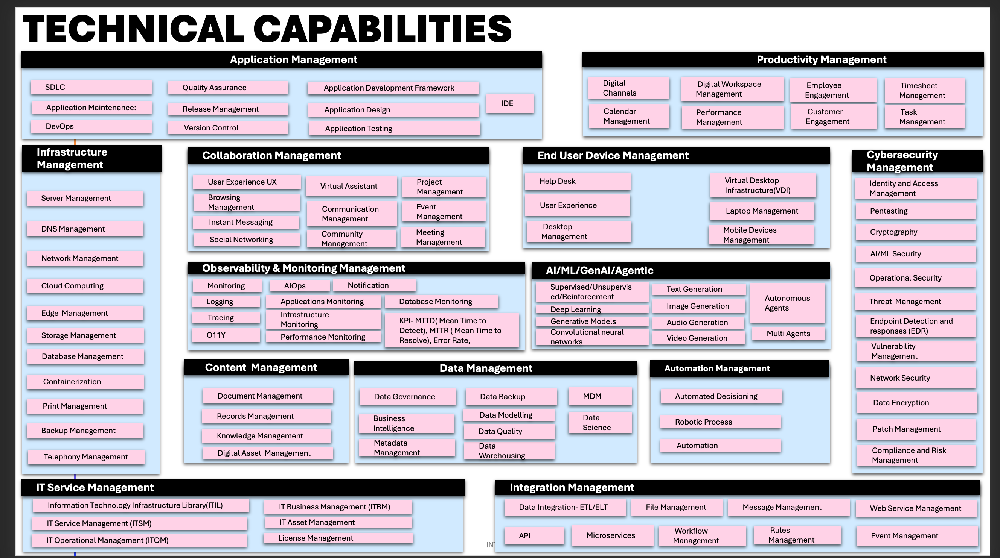
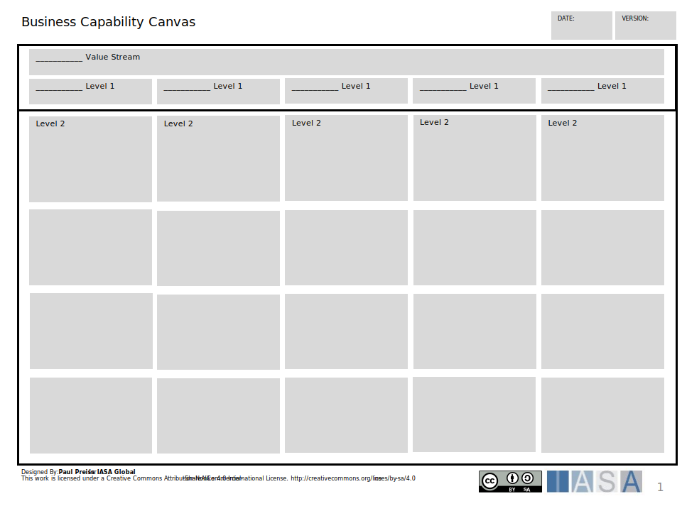
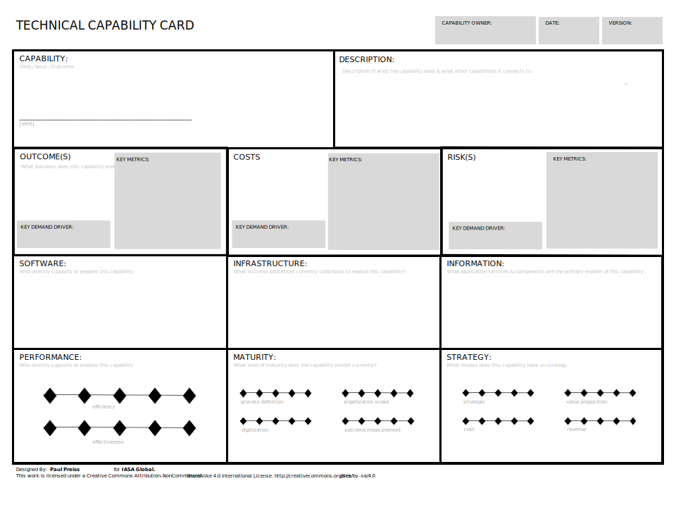

> "It's OK to borrow against the future, as long as you pay it off."
> **Ward Cunningham**

### Overview

The technology landscape represents the living environment of technologies, applications, and platforms in which architects create value. It is the foundation on which an architecture practice understands current reality, plans transformations, and enables innovation. Unlike static documentation, the landscape is a continuously evolving representation of technical capabilities and applications.

For architecture practices of any size, the landscape provides a **shared language** for technology decision-making. By making capabilities visible and applications accountable, it equips stakeholders to lead in areas of investment, transformation, and governance.

> “It’s OK to borrow against the future, as long as you pay it off.”  
> — Ward Cunningham

---

## The Landscape as a Practice

Treating the technology landscape as an ongoing practice—rather than a one-time assessment—is essential. The practice ensures:

- **Continuity across the lifecycle** – from innovation, through strategy, planning, and transformation, to decommission.

- **Transparency for stakeholders** – creating a neutral, professional view of technology assets.

- **Resilience in decision-making** – avoiding lock-in, redundancy, or fragile integrations.

Architecture practices use two cornerstone techniques for landscape work:

1. **Technology Capability Models and Cards** – to describe and assess the enduring technical functions an organization must deliver.

2. **Application Portfolio Techniques** – to manage, rationalize, and innovate across deployed systems.

These are complemented by roadmap balancing, transformation agendas, and innovation controls.

## Definitions

# Definitions Table from the Diagram

| Term                              | Final Definition (BTABoK + Industry)                                                                                                                                                                                                                                                                                                                                                                                                                         |
| --------------------------------- | ------------------------------------------------------------------------------------------------------------------------------------------------------------------------------------------------------------------------------------------------------------------------------------------------------------------------------------------------------------------------------------------------------------------------------------------------------------ |
| **Platform**                      | A set of basic building blocks for a technology service or product, often combining infrastructure, applications, and tools into a foundation upon which other solutions are built. Industry: Gartner defines a platform as “a set of software and sometimes hardware components that provide common services and capabilities for applications.” In practice, platforms create consistency, scalability, and repeatability across the technology landscape. |
| **Capability**                    | An activity or function an organization must perform to fulfill its mission. Industry: Business Architecture Guild defines a capability as “a particular ability or capacity that a business may possess or exchange to achieve a specific purpose or outcome.” Capabilities are stable over time and independent of organization structure or vendor solutions.                                                                                             |
| **Service**                       | Work done to create a result for a client, combining people, processes, and technology into a consumable outcome. Industry: ITIL defines a service as “a means of enabling value co-creation by facilitating outcomes that customers want to achieve, without the customer having to manage specific costs and risks.”                                                                                                                                       |
| **Technical (Service Component)** | A technology component that creates a result, such as a server, database, or software module. Industry: TOGAF refers to these as “technology components,” which are deployable units of technology that provide specific functionality.                                                                                                                                                                                                                      |
| **Service Type**                  | A classification or category of services, used to group similar service offerings. Industry: ITIL uses the term “service category” to differentiate between customer-facing services (business services) and supporting services (technical or infrastructure services).                                                                                                                                                                                     |
| **Business (Service Component)**  | A set of work which results in a business outcome. Industry: Business architecture defines business services as “services offered to external or internal customers that deliver measurable business value.”                                                                                                                                                                                                                                                 |
| **Application**                   | A program or piece of software designed to fulfill a particular purpose. Industry: ISO/IEC/IEEE 24765 defines application software as “software designed to help the user to perform a specific task or process.” In architecture practice, applications are the building blocks of the application portfolio.                                                                                                                                               |
| **Product**                       | An item or service offered for sale or consumption. Industry: ISO 9000 defines a product as “the result of a process,” which can include hardware, software, or services. In digital practices, a product may be an IT-enabled offering managed with its own lifecycle.                                                                                                                                                                                      |
| **API**                           | An Application Programming Interface: a defined communication method between technical services, exposing data or functions in a structured, reusable way. Industry: ISO/IEC 19501 defines an API as “a set of operations, messages, and data structures that enable interaction between applications or components.”                                                                                                                                        |
| **Process**                       | A set of activities or tasks designed to create a specific result. Industry: ITIL defines a process as “a structured set of activities designed to accomplish a specific objective.” Processes convert inputs into outputs in a repeatable, measurable way.                                                                                                                                                                                                  |

## # Technical Capabilities

The technology landscape can only be described meaningfully if the practice speaks a consistent language. Vendor names and project nicknames change constantly. What remains stable are the **capabilities** an organization must perform, the **platforms** they rely on, the **applications** and **APIs** that deliver them, and the **processes** and **services** that make them real.

The BTABoK approach anchors this in a **Technology Capability Model (TCM)**. A TCM is not a product list. It is a catalog of **capabilities** — those enduring activities that the organization requires to fulfill its mission. These capabilities are then mapped to the **applications, platforms, and services** that support them, creating a shared framework for analysis, investment, and governance.

---

## How to Work with Technical Capabilities

**At its core, a practice will:**

1. **Identify the capabilities** that exist in the landscape (e.g., identity management, data integration, observability).

2. **Anchor them in definitions** (per the BTABoK value diagram) so stakeholders know what “capability,” “platform,” or “application” means.

3. **Assess capability maturity** using structured **Capability Cards**.

4. **Connect capabilities to the application portfolio**, clarifying which applications or APIs deliver which outcomes.

5. **Use the model to inform roadmaps, governance, and transformation agendas.**

---

### Identifying Capabilities

The starting point is the **capability** definition: “an activity an organization must perform to fulfill its mission.” Using the reference diagram, architects frame conversations in terms of identity, data, integration, observability, and automation rather than brand names. For example, “API Management” is a capability; MuleSoft or Apigee are platforms that deliver it.

This separation matters because it removes vendor lock-in from the conversation. If the business strategy changes, the capability definition endures — only the supporting **applications**, **APIs**, or **platforms** may need to be swapped.

### Anchoring in Shared Definitions

The BTABoK definitions table ensures that everyone understands the building blocks:

- A **platform** is the foundation on which applications and services run.

- A **service** is work that produces results for a client.

- An **application** is a specific program or piece of software that fulfills a purpose.

- A **process** is the repeatable set of activities that makes the capability real.

By aligning discussion to these terms, the practice avoids ambiguity and can more easily explain technical decisions to stakeholders.

### Assessing Capability Maturity

Capabilities are not static; they vary in maturity. Some may be robust and automated, others fragile or improvised. Practices capture this variation using **Capability Cards** — structured assessments that document the definition, maturity, ownership, risks, and supporting applications for each capability.

 

In a workshop setting, architects facilitate discussions using these cards. Stakeholders debate whether a capability is “good enough,” whether the underlying processes are standardized, and whether the applications that deliver it are reliable. The act of filling out the card forces clarity about value and risk.

### Connecting to the Application Portfolio

Every capability must be realized by something in the real world — usually an **application** or **platform**. For example, the “Observability” capability might be delivered by Splunk and Datadog, while “Identity Management” may rest on Okta and Active Directory. Mapping these relationships shows where there are redundancies, where a single fragile tool is a point of failure, and where investments are actually being made.

This creates a bridge between **capability thinking** and **application portfolio management**. The practice can now answer questions like: *Which capabilities are over-invested in? Which are under-served? Where do we carry unnecessary redundancy?*

### Informing Roadmaps and Governance

Finally, capability models are not static diagrams; they become **governance and planning tools**. When a new technology proposal comes forward — say, a low-code automation platform — the question is framed as: *Which capability does this strengthen? What is its current maturity? Does this investment align with our transformation agenda?*

This moves decision-making away from hype and toward **structured value realization**, tying directly into lifecycle stages, legacy modernization, and investment prioritization.

---

## Why Technical Capabilities Matter

By using a consistent vocabulary and structured techniques, practices gain:

- **Clarity** – decisions framed in terms of enduring capabilities, not vendor hype.

- **Accountability** – capability cards make ownership and maturity visible.

- **Alignment** – investment planning links directly to technical capability health.

- **Resilience** – landscapes evolve with less risk of redundancy and technical debt.

In this way, the Technical Capability Model is the **skeleton of the landscape**. Applications and platforms may shift, but the capability framework ensures the practice stays focused on value, maturity, and transformation.

### How to Use Capability Cards

Capability Cards are the central technique for working with technical capabilities at the second and third levels of detail. They transform the abstract model of the technology landscape into a **living practice tool**. The card itself is the method: every section forces a conversation that links technical realities to value, [lifecycle](architecture_lifecycle.html), governance, and investment planning.

  

## Capability and Definition

The card begins with the capability name and definition. A capability is the activity an organization must perform to fulfill its mission. Anchoring in a clear definition ensures that workshops do not drift into vendor discussions.

- *Example*: Identity Management – the ability to create, manage, and retire user and system identities securely across their lifecycle.

## Scope and Boundaries

Next, define the scope of the capability. This prevents overlap and clarifies what belongs to neighboring capabilities.

- *Example*: Identity Management includes SSO, MFA, and provisioning, but excludes role definitions inside each application.

## Value and Outcomes

Every card documents the outcomes the capability enables. This connects capability maturity to the value model.

- *Example*: Provides secure, seamless access for employees and partners; reduces audit findings.

## Maturity Assessment

Cards record maturity on a simple scale, often 1–5. This rating is not abstract; it is agreed collaboratively in workshops, based on evidence from processes, services, and platforms.

## Supporting Dimensions

The central block of the card maps all the technical dimensions that make a capability real:

- **Software** – specific programs in use.

- **Infrastructure** – servers, cloud services, and networks.

- **Information** – the data objects and flows.

This is where gaps, duplication, and technical debt become visible. For example, multiple applications may be delivering the same service, or a critical process may depend on manual intervention.

Additional Areas to Explore:

- **Processes** – repeatable activities that deliver consistency.

- **Services** – outcomes consumed by users or other systems.

- **Platforms** – the foundation environments the capability sits on.

- **APIs** – the interfaces exposing the capability for reuse.

## Ownership

Every card assigns an accountable owner. This person or team is responsible for capability maturity and for ensuring that governance findings lead to action. Lack of ownership is one of the most common weaknesses exposed during card workshops.

## Risks and Technical Debt

This section records fragilities that limit the capability. It links directly to the BTABoK’s technical debt guidance. Examples include reliance on unsupported software, excessive manual processes, or vendor lock-in.

## Costs

Cards identify the main cost drivers: license fees, cloud consumption, infrastructure overheads, and staff effort. This creates traceability to investment planning.

## Strategy and Roadmap

Finally, cards document the near-term actions to improve the capability. These actions feed directly into the [architecture lifecycle](architecture_lifecycle.html) and transformation agendas.

## Running a Capability Card Workshop

A typical practice session involves:

1. Selecting related capabilities (for example, all security sub-capabilities).

2. Preparing baseline definitions from the capability model.

3. Facilitating a collaborative workshop where participants complete each card.

4. Comparing cards side by side to see strengths and weaknesses.

5. Feeding the results into application portfolio management, roadmaps, and governance.

Capability Cards are not just documentation. They are **conversation tools**. They expose ownership gaps, fragile processes, and duplicated software, and they make those realities transparent to decision-makers. When used consistently, they provide the practice with a living dashboard of capability health that connects directly to value, lifecycle, and governance.

## Application Portfolio Mapping

The application portfolio is the visible surface of the technology landscape. Where capabilities describe what the organization must be able to do, the portfolio describes how those functions are currently realized through applications, services, platforms, and APIs. Every SaaS subscription, every on-premise solution, every homegrown tool belongs here. Together they form the operating reality of the enterprise.

### The application portfolio belongs to IT management

It is their instrument of accountability. Architects help define, structure, and analyze the portfolio, but day-to-day ownership—updating records, confirming lifecycle states, ensuring costs are accurate—sits with IT leadership. Without this ownership, the portfolio becomes just another abandoned register.

## Why IT must own the portfolio

An unmanaged portfolio is the silent killer of technology value. Without stewardship, redundancy creeps in, costs rise, and fragile legacy systems remain critical far past their safe life. IT management is the only function with both the operational mandate and the authority to maintain fidelity. This is why ownership cannot be left to architects alone.

The portfolio becomes the common ledger that ties together capability cards, [lifecycle states](architecture_lifecycle.html), and investment planning. In practice, IT leaders use it to answer hard questions:

- Which applications deliver the most important services?

- Where are there duplicates competing for the same capability?

- What is the cost of sustaining fragile legacy versus modernizing?

- Which lifecycle exits are overdue?

These are management questions, informed by architectural technique.

## How architects support IT ownership

Architecture practice ensures the portfolio is more than an inventory. By linking each application to specific capabilities and placing them on the [lifecycle](architecture_lifecycle.html), architects make the portfolio a decision engine. They lead workshops, prepare rationalization cases, and highlight risks. But the act of confirming what is in use, what it costs, and who owns it—that is IT management’s work.

## Rationalization as shared responsibility

Rationalization decisions—keep, modernize, migrate, retire—must be evidence-based. Architects bring the evidence: maturity of the capability, risk of technical debt, alignment with strategic transformation. IT management brings the accountability: funding, resourcing, and the final calls on execution. Together, they ensure rationalization strengthens the overall practice instead of creating a culture of unchecked tool adoption.

## Continuous cadence

Portfolios rot quickly if ignored. IT management must run portfolio governance on a cadence, reviewing parts of the landscape regularly. Architects act as facilitators, but it is IT managers who must insist that application owners confirm their records, lifecycle states, and roadmaps. This regular rhythm transforms the portfolio from a static list into a living management tool.

## Application Portfolio as part of the engagement model

A portfolio practice begins with a series of disciplined steps. Each is simple on its own, but together they create a management system that keeps technology aligned with outcomes.

### Inventory with intent

The first task is to capture every application, including SaaS and “shadow IT,” but only with the minimum data needed to make decisions. Each record is an *application card*—name, owner, purpose, capability mapping, interfaces, core information domains, run facts, costs, and current health. One or two hours per record is enough; perfection comes later. The point is discoverability, not paralysis.

### Classify for meaning

Classification transforms a list into a portfolio. Each application must be tagged for business criticality (Tier 1–3), technical health (green, amber, red), information sensitivity, and its dependency role (system of record, engagement, integration hub, analytical). These tags allow comparison. If two applications serve the same capability but one is Tier-1 and in poor health, the rationalization path is obvious.

### Link to capabilities

Every application must be traced to the capability it supports at level 2–3, not just to a broad domain. This linkage is where the portfolio meets the capability cards. Pulling in the maturity, risks, and ownership from the cards lets the practice slice the portfolio by capability health. This keeps the conversation anchored in outcomes instead of vendor brands.

**Assess lifecycle state**  
Applications are placed on the [lifecycle](architecture_lifecycle.html) map: innovate, grow, sustain, decommission. This assignment must be auditable: who decided, why, when. Applications without a state drift into “forever sustain,” creating hidden debt. Clear lifecycle states provide the backbone for roadmaps and transformation programs.

**Rationalize deliberately**  
With inventory, classification, capability mapping, and lifecycle states in place, rationalization can proceed with evidence. Some applications will be kept and sustained, others modernized or migrated, and some retired. Rationalization is not just about cost cutting—it is about strengthening capabilities and removing duplication. Side-by-side comparisons reveal overlap: three reporting tools mapped to the same capability is not efficiency, it is waste. Rationalization ties back into capability card actions, ensuring that every decision improves capability maturity.

**Govern on a cadence**  
A portfolio is a living thing. Without a regular rhythm, it decays. IT management must establish a cadence—monthly, quarterly—where domain owners present changes, risks, and planned lifecycle exits. Architects support by preparing the evidence and facilitating the sessions, but accountability remains with IT management. This cadence replaces the dreaded “big annual audit” with continuous governance.

**Measure what matters**  
Finally, portfolio management succeeds only if it produces measurable outcomes. Start with a handful of metrics: redundancy index (apps per capability), risk coverage (% with owner and SLOs), lifecycle velocity (% changing state per quarter), cost-to-value signal, and stability (change failure rate, MTTR). If the redundancy index for reporting stays high, mandate a consolidation plan. These measures are not vanity—they are commitments to value, risk reduction, and velocity.

## The minimal application record

Every application must have a record, simple enough that owners cannot avoid filling it in, but rich enough to support decisions.

**Application:**  
**Owner:**  
**Purpose / Service:**  
**Primary Capability (L2/3):**  
**APIs (exposed/consumed):**  
**Key Dependencies:**  
**Information Domains & Sensitivity:**  
**Platform & Run Facts (SLO, RTO/RPO):**  
**Costs (license/run/people):**  
**Lifecycle State:** Innovate | Grow | Sustain | Decommission  
**Health (G/A/R) & Risks:**  
**Next Decision (Keep | Modernize | Migrate | Retire) + Date:**

By rooting ownership in IT management, the portfolio is no longer a side exercise—it becomes an executive instrument. It ties architecture to accountability:

- It provides the baseline for every [transformation](architecture_lifecycle.html#transformation).

- It supports investment planning with cost-to-capability evidence.

- It enforces the societal contract by keeping critical systems visible and responsibly managed.

The portfolio belongs to IT management, but architects ensure it is used as intended: to guide decisions, surface risks, and steer transformation.

## # Balancing and Managing Quality Attributes

An application portfolio is not only about counting licenses or retiring duplicates. Its real power emerges when it is connected to the organization’s [quality attributes](quality_attributes.html). These attributes—security, resilience, usability, performance, sustainability—are the cross-cutting properties that define whether the technology landscape is fit for purpose.

Every architect has seen the pattern: the portfolio looks orderly on paper, but the systems within it fail in practice because quality attributes are inconsistent, unmeasured, or ignored. An application that is technically “sustained” can still be a liability if it cannot meet basic resilience targets or creates ongoing usability pain for customers.

## Linking attributes to the portfolio

The technique is to treat quality attributes as **filters** across the portfolio. For each application record, IT management must include measurable signals of attribute health:

- **Performance:** SLAs or SLOs (latency, throughput, error rates).

- **Security:** last penetration test date, outstanding vulnerabilities, MFA adoption.

- **Resilience:** recovery time objectives (RTO/RPO), failover tests, dependency fragility.

- **Usability:** user satisfaction scores, complaint trend.

- **Sustainability:** energy usage, CO₂ footprint, lifecycle efficiency.

When aggregated, these measures reveal not just which applications exist, but how the landscape as a whole performs on its non-functional promises.

## Balancing across competing attributes

No portfolio can maximize every quality attribute simultaneously. Trade-offs must be made, and the portfolio provides the place where those trade-offs are exposed. For example:

- Optimizing for **performance** (ultra-low latency) may increase **cost** or decrease **sustainability**.

- Maximizing **security** may constrain **usability**, as stricter access controls add friction.

- Pushing for **sustainability** may initially reduce **performance** until new platforms stabilize.

By making these tensions visible in the portfolio, architects enable IT management and business leaders to negotiate priorities consciously, instead of letting them emerge accidentally. This links directly to the [architecture lifecycle](architecture_lifecycle.html), where strategy and planning phases must make explicit which attributes drive the next transformation.

## Using quality attributes for rationalization

Rationalization decisions should never be cost-only. If two applications serve the same capability, the decision about which to keep may rest on attribute performance. For example, a reporting tool that is cheap but insecure and unsustainable should be retired in favor of one that better aligns with organizational attribute goals.

This ensures that portfolio management strengthens the architecture’s overall quality, not just its balance sheet.

## Continuous monitoring

Like the portfolio itself, quality attributes are never “done.” They must be monitored as part of portfolio cadence. IT management reviews should not only track lifecycle states but also check attribute measures: which applications are drifting out of compliance, which are trending toward fragility, which are exceeding expectations.

When attribute management is embedded in the portfolio, architects can tell a clear story: not just how many applications exist, but how those applications deliver the quality the organization promises to its stakeholders. This is where the portfolio supports the architect’s societal contract—ensuring systems are not only functional, but safe, ethical, and resilient for the people who depend on them.

## # Connecting to Innovation and Roadmaps

A living application portfolio is not just about sustaining what exists. Its real value is in how it fuels **innovation** and aligns with **roadmaps**. The portfolio belongs to IT management, but it becomes powerful when used as an investment technique: linking the health of capabilities to application-level decisions, and then expressing those decisions in the [architecture lifecycle](architecture_lifecycle.html).

Innovation almost always touches the portfolio first. A new SaaS tool is trialed, a proof-of-concept is launched, or a partner demands integration. If these efforts are left outside the portfolio, they become unmanaged sprawl. By tracking them in the portfolio and moving them through lifecycle stages, IT leaders and architects create a direct line from experimentation to strategic investment.

## The portfolio through the lifecycle

- **Innovation Cycle**  
  New ideas are added as “innovate” applications. They are tied to explicit capabilities and tracked with minimal but meaningful data: purpose, expected value, interfaces, and scope of experiment. This ensures that experiments are not invisible spend but structured entries in the ledger.

- **Strategy**  
  In the strategy phase, these innovations are weighed against capability gaps and value outcomes. Do they strengthen an underperforming capability (as seen in its capability card)? Do they reduce risk in a fragile part of the portfolio? Only those with clear capability fit move forward.

- **Planning**  
  Planning is where the portfolio becomes an investment instrument. Architects and IT management identify what the innovation will replace or augment, what dependencies exist, and how costs align with capability priorities. Rationalization choices—modernize, migrate, retire—are tied explicitly to capability needs.

- **Transformation**  
  During transformation, portfolio entries change state. New applications move into “grow,” legacy systems shift toward decommission. Architects govern quality attributes and compliance, but the portfolio provides the traceability of investment: which applications received funding and why.

- **Utilize and Measure**  
  Once live, applications move to “sustain” and are measured. Success is not just uptime but contribution to capability outcomes: did security improve, did performance increase, did cost-to-value ratios align? Portfolio metrics become feedback into investment decisions.

- **Decommission**  
  Eventually, every system exits. The portfolio makes decommissioning a managed investment step—freeing resources, reducing risk, and signaling capability shifts. Funds reclaimed from retirements are visible as part of the investment cycle, not hidden in operational noise.

## Portfolio as an investment technique

Seen this way, the application portfolio is more than a catalog. It is a **technical capability to investment technique**. Every record links an application to a capability, places it on the lifecycle, and ties it to cost and risk. This transforms the portfolio into a decision framework:

- Investments are justified by capability outcomes, not vendor pressure.

- Roadmaps are expressed as sequences of portfolio moves, making transformation accountable.

- Innovation is no longer “shadow spend” but an explicit part of the investment cycle.

This technique grounds abstract strategy in concrete application changes, giving leaders both visibility and control.

### The collaborative technique

1. **Frame with objectives**  
   The practice begins with the objectives the organization has set. These objectives are not abstract strategy—they are the agreed value outcomes that architecture is accountable to help achieve. Every architect, regardless of specialization, must understand how their domain contributes.

2. **Hold the capability conversation**  
   Using the capability model and cards, the practice facilitates workshops where architects across domains discuss how current capabilities support or block the objectives. Software architects may highlight development speed constraints, infrastructure architects may raise resilience risks, solution architects may expose integration fragility, and information architects may show data governance gaps. This shared assessment becomes the bridge from objective to portfolio.

3. **Map into the portfolio together**  
   Applications are then examined not in isolation but as a set of interdependent assets. Each architect type brings their lens:
   
   - Solution architects: how the applications combine into flows and business outcomes.
   
   - Software architects: code-level sustainability and extensibility.
   
   - Infrastructure architects: hosting, performance, resilience.
   
   - Information architects: data domains, lineage, compliance.
   
   - Security architects: exposure, identity, and control gaps.  
     By pooling these views into the application portfolio record, the practice creates a multidimensional picture that no single role could see alone.

4. **Derive investment moves**  
   Once objectives, capabilities, and applications are linked, the practice asks: *What portfolio changes must be made to achieve the objectives?* Some applications may be modernized, some consolidated, others retired. These decisions are not “EA traceability exercises” but joint judgments made visible and agreed by the whole practice.

5. **Translate into roadmap actions**  
   The practice then works with IT management to place these moves on the roadmap. Each roadmap item is a portfolio change justified by objective alignment: migrate this application to strengthen resilience, retire these duplicates to reduce cost, introduce this SaaS platform to enable new customer services.

6. **Carry through the lifecycle**  
   As the roadmap executes, each application is moved through the lifecycle stages—innovation, strategy, planning, transformation, utilization, and decommission. This provides continuity across the practice, ensuring that architects of every type stay engaged from start to finish.

### Practice-wide ownership

This approach makes portfolio management a **practice ritual**, not a management chore. It requires participation across domains, with each architect type contributing evidence, insight, and judgment. The result is a portfolio that reflects the true complexity of the landscape and a roadmap that is credible because it was forged collaboratively.

## Summary

The technology landscape is both the map and the territory of modern architecture practice. Through **Technology Capability Models**, **Capability Cards**, and **Application Portfolio Techniques**, practices create visibility, discipline, and strategic alignment.

- Capability models define the stable foundation of technical function.

- Capability cards make those foundations measurable and actionable.

- Application portfolios ensure that the current reality is understood, rationalized, and aligned to strategy.

By linking these techniques to lifecycles, roadmaps, and innovation agendas, architecture practices of any size can lead technology decisions with clarity and purpose.

---

## References and Further Reading

- [TBM Taxonomy v4.0](https://community.tbmcouncil.org/viewdocument/tbm-taxonomy-v40-final-documents?utm_source=chatgpt.com)

- [Defining Technology Capabilities | The Essential Project](https://enterprise-architecture.org/university/defining-technology-capabilities/?utm_source=chatgpt.com)

- [Application Reference Model | The Essential Project](https://enterprise-architecture.org/university/application-reference-model/?utm_source=chatgpt.com)

- [Value of Technical Capability Models | MP3Monster’s Blog](https://blog.mp3monster.org/2018/11/01/value-of-technical-capability-models/?utm_source=chatgpt.com)

- BTABoK 3.0 by [IASA](https://iasaglobal.org/?utm_source=chatgpt.com) (Creative Commons License)

#](https://blog.mp3monster.org/2018/11/01/value-of-technical-capability-models/)

BTABoK 3.0 by [IASA](https://iasaglobal.org/) is licensed under a [Creative Commons Attribution-NonCommercial--NonCommercial 4.0 International License](http://creativecommons.org/licenses/by-nc/4.0/). Based on a work at [https://btabok.iasaglobal.org/](https://btabok.iasaglobal.org/)

Example Capability Card: Data Integration

**TECHNICAL CAPABILITY CARD**

**DATE:** 2025-09-02  
**VERSION:** 0.1 (Draft)

**CAPABILITY:** Data Integration (connect, transform, and move data across systems to ensure consistent, timely, usable information)

**CAPABILITY OWNER:** Head of Data Engineering (Enterprise Data Team)

**DESCRIPTION:**  
Ability to ingest, transform, and deliver data between operational, SaaS, and analytics systems. Connects to **Master Data Management**, **Analytics/BI**, **Event Streaming**, and **Data Governance** capabilities. Abstracts vendor tools behind stable integration patterns (batch ETL, CDC, streaming, API-based moves).

**OUTCOME(S)**

- Trusted, timely data for regulatory reporting and management dashboards.

- Reduced time-to-insight for product and go-to-market decisions.

- Lower integration lead time for new SaaS and partner systems.  
  Measured by delivery latency, success rate, data completeness, and change lead time.

**MATURITY:** Level 2 (Basic) – Mixed tooling, limited automation/observability; several point-to-point flows.

**SOFTWARE:**  
Talend; custom Python ETL; dbt (transform); Airflow (orchestration); Kafka Connect (where used).

**INFRASTRUCTURE:**  
Azure Data Factory pipelines; Azure Storage/ADLS; on-prem SFTP jump hosts; Kafka cluster (limited scope).

**INFORMATION:**  
Customer, product, order, and financial datasets; operational logs; reference/master data; schema registry (partial).

**PERFORMANCE:**

- Batch SLA: ≤ 4 hours post-close (regulatory feeds).

- Streaming targets: p95 end-to-end < 30s where implemented.

- Success rate: ≥ 99.5% per day; automated retries for transient faults.

**SOURCING:**  
Hybrid — in-house data engineers (core flows) plus managed iPaaS vendor for commodity SaaS connectors.

**STRATEGY:**  
Standardize on **iPaaS + CDC + dbt**; retire bespoke point-to-point scripts; expand event-driven patterns for near-real-time use cases; embed observability and data quality checks in every pipeline.

**KEY METRICS:**

- Delivery latency (by domain/feed)

- Job success rate & MTTR for failures

- Data completeness/quality scores (DQ rules passed)

- Change lead time for new integrations

- Cost per maintained interface

**KEY DEMAND DRIVER:**  
Regulatory reporting (monthly/quarterly), enterprise analytics backlog, and new SaaS/partner onboarding.

**KEY DEMAND DRIVER:**  
Product telemetry and near-real-time operational dashboards (marketing, supply chain).

**COSTS**  
Cloud compute/storage for pipelines; iPaaS subscription; licenses (ETL/orchestration); engineer FTEs; Kafka ops where applicable.

**RISK(S)**  
Operational fragility from legacy point-to-point jobs; insufficient end-to-end monitoring; schema drift breaking downstream consumers; constrained skills on bespoke scripts; compliance exposure from missed SLAs.
